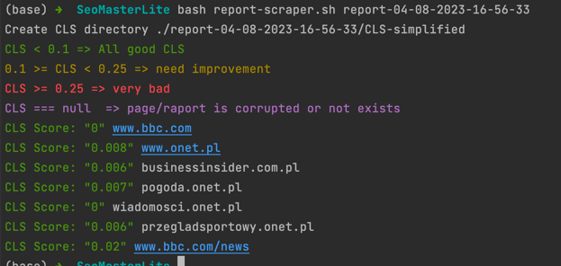
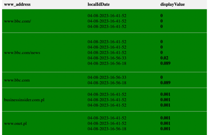

# SeoDevAudit

## Description/Motivation

This tool is designed to produce SEO audits and store historical data. Since Google Search Console does not support storing archival data and it's impossible to get a report for a specific URL (Google Search Console combines all URLs audits and makes average scores), this tool can help you with that.

In the project I'm currently working on, we started to notice significant drops in SEO rankings (mainly CLS). To address the issue, I wrote a couple of scripts (bash for scraping, js to reduce the dataset, basic Node.js server to serve simple HTML so it's easier to detect what URLs have issues).

Those scripts/solutions are available in `./deprecatedScripts` and eventually will be refactored (then removed) to the project you're currently looking at.

## Project status, how to use it

The tool is not ready yet, however, if you want, you can jump to `./deprecatedScripts` and use it to produce reports for your website. The reports will be stored in the same directory. Depending on what settings you choose, you can output HTML or just JSON files and then run the Node.js server to see all results in a simple table.

**Prerequisites: you need to have Lighthouse CLI installed**

**Prepare URLs for audit in a text file, as shown in `./deprecatedScripts/config/exampleUrls`**

**Run CLS-audit for mobile:**

```bash

bash lighthouse-cli.sh ./deprecatedScripts/config/exampleUrls.txt

```

**Or run all audits for desktop (also generates HTML):**

```bash

bash lighthouse-cli.sh ./deprecatedScripts/config/exampleUrls.txt --html-output

```

**Simplify/scrap CLS audit from Lighthouse audit:**

```bash

bash report-scraper.sh <report-dir-name-generated-by-previous-script>

```



**Create/update report.csv:**

```bash

node generateHistoricalReport.js <report-dir-name>/CLS-simplified/

```

**Host simple HTML so you can sort/filter pages that are problematic:**

```bash

node server.js

```



## What will be included in the Beta version

_(Add details about what features or improvements are planned for the Beta version)_

## Definition of Done (DoD)

### DevOps

- [ ] Placeholder 1

- [ ] Placeholder 2

- [ ] Placeholder 3

### Continuous Integration (CI)

- [ ] Placeholder 1

- [ ] Placeholder 2

- [ ] Placeholder 3

### Server

- [ ] Placeholder 1

- [ ] Placeholder 2

- [ ] Placeholder 3

### Client

- [ ] Placeholder 1

- [ ] Placeholder 2

- [ ] Placeholder 3

### Instruction/Readme

- [ ] Placeholder 1

- [ ] Placeholder 2

- [ ] Placeholder 3

## Future Plans

Lorem ipsum dolor sit amet, consectetur adipiscing elit. Suspendisse a tincidunt orci, quis cursus orci. Vestibulum quis cursus orci.
